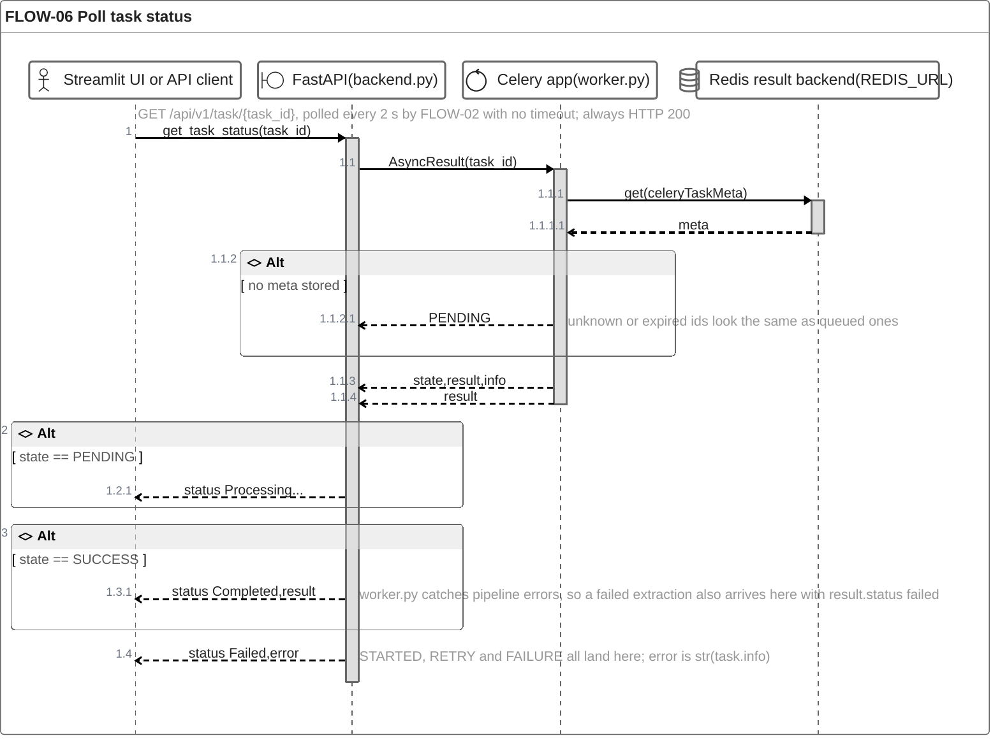

```mermaid
zenuml
title FLOW-06 Poll task status
@Actor Client as "Streamlit UI or API client"
@Boundary API as "FastAPI (backend.py)"
@Control Celery as "Celery app (worker.py)"
@Database Redis as "Redis result backend (REDIS_URL)"

// `GET /api/v1/task/{task_id}`, polled every 2 s by FLOW-02 with no timeout; always HTTP 200
Client->API.get_task_status(task_id) {
  result = Celery.AsyncResult(task_id) {
    meta = Redis.get(celeryTaskMeta)
    if("no meta stored") {
      // unknown or expired ids look the same as queued ones
      return PENDING
    }
    return "state, result, info"
  }
  if(state == PENDING) {
    @return API->Client: status Processing...
  }
  if(state == SUCCESS) {
    // worker.py catches pipeline errors, so a failed extraction also arrives here with result.status failed
    @return API->Client: status Completed, result
  }
  // STARTED, RETRY and FAILURE all land here; error is str(task.info)
  return "status Failed, error"
}
```
