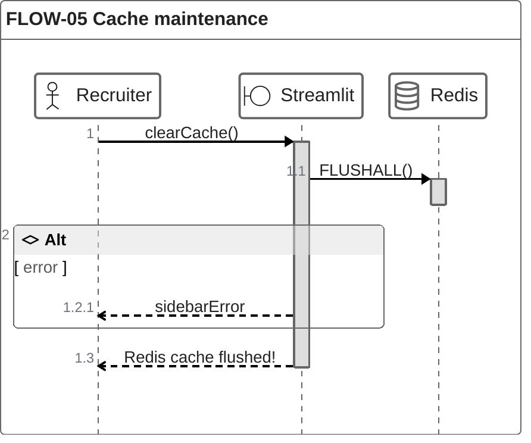

# FLOW-05 Cache maintenance

```mermaid
zenuml
    title FLOW-05 Cache maintenance
    @Actor Recruiter
    @Boundary Streamlit
    @Database Redis
    Recruiter->Streamlit.clearCache() {
      Redis.FLUSHALL()
      if(error) {
        return sidebarError
      }
      return "Redis cache flushed!"
    }
```

Note: the "Force Re-parse" checkbox is rendered but not wired — FLOW-02 always calls `process_and_link_resume(force_refresh=False)`.
