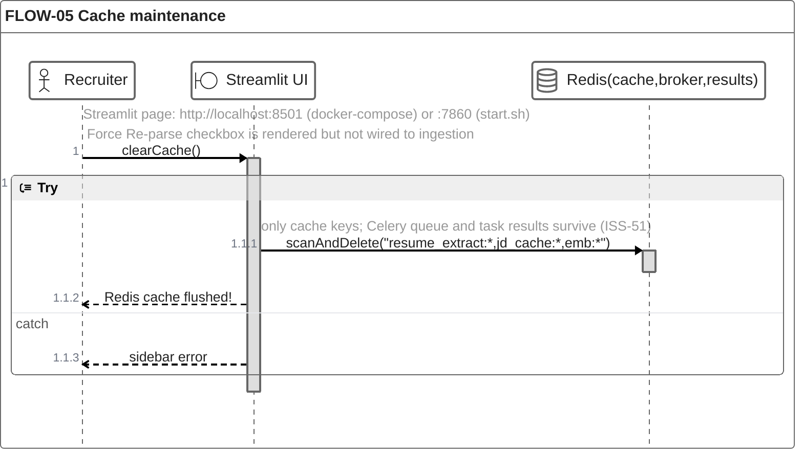

```mermaid
zenuml
title FLOW-05 Cache maintenance
@Actor Recruiter
@Boundary UI as "Streamlit UI"
@Database Redis as "Redis (cache, broker, results)"

// Streamlit page: `http://localhost:8501` (docker-compose) or `:7860` (start.sh)
// Force Re-parse checkbox is rendered but not wired to ingestion
Recruiter->UI.clearCache() {
  try {
    // only cache keys; Celery queue and task results survive (ISS-51)
    Redis.scanAndDelete("resume_extract:*, jd_cache:*, emb:*")
    return "Redis cache flushed!"
  } catch {
    @return UI->Recruiter: sidebar error
  }
}
```
