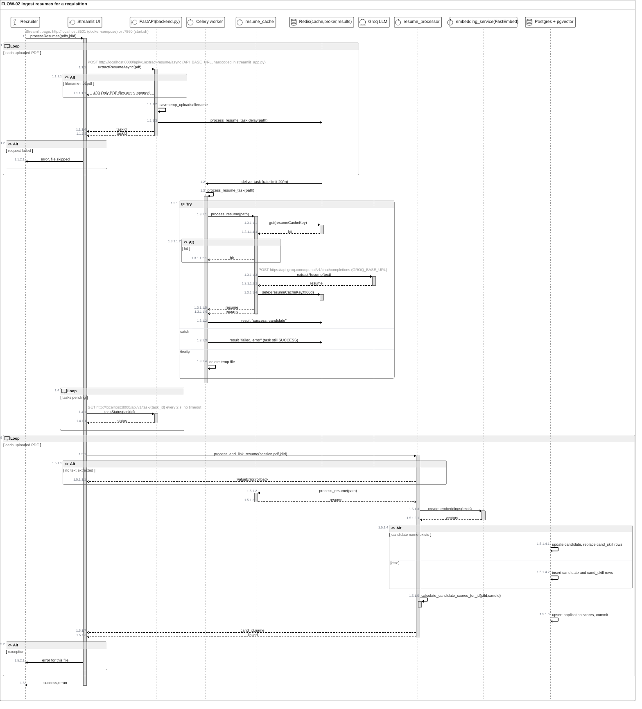

```mermaid
zenuml
title FLOW-02 Ingest resumes for a requisition
@Actor Recruiter
@Boundary UI as "Streamlit UI"
@Boundary API as "FastAPI (backend.py)"
@Control Worker as "Celery worker"
@Control Cache as "resume_cache"
@Database Redis as "Redis (cache, broker, results)"
@Entity Groq as "Groq LLM"
@Control Proc as "resume_processor"
@Control Embed as "embedding_service (FastEmbed)"
@Database DB as "Postgres + pgvector"

// Streamlit page: `http://localhost:8501` (docker-compose) or `:7860` (start.sh)
Recruiter->UI.processResumes(pdfs, jdId) {
  loop("each uploaded PDF") {
    // `POST http://localhost:8000/api/v1/extract-resume/async` (API_BASE_URL, hardcoded in streamlit_app.py)
    taskId = API.extractResumeAsync(pdf) {
      if("filename not .pdf") {
        @return API->UI: 400 Only PDF files are supported
      }
      API->API: save temp_uploads/filename
      API->Redis: process_resume_task.delay(path)
      return taskId
    }
    if("request failed") {
      UI->Recruiter: error, file skipped
    }
  }
  Redis->Worker: deliver task (rate limit 20/m)
  Worker->Worker.process_resume_task(path) {
    try {
      resume = Cache.process_resume(path) {
        hit = Redis.get(resumeCacheKey)
        if(hit) {
          return hit
        }
        // `POST https://api.groq.com/openai/v1/chat/completions` (GROQ_BASE_URL)
        resume = Groq.extractResume(text)
        Redis.setex(resumeCacheKey, ttl60d)
        return resume
      }
      Worker->Redis: result "success, candidate"
    } catch {
      Worker->Redis: result "failed, error" (task still SUCCESS)
    } finally {
      Worker->Worker: delete temp file
    }
  }
  while("tasks pending") {
    // `GET http://localhost:8000/api/v1/task/{task_id}` every 2 s, no timeout
    status = API.taskStatus(taskId)
  }
  loop("each uploaded PDF") {
    linked = Proc.process_and_link_resume(session, pdf, jdId) {
      if("no text extracted") {
        @return Proc->UI: ValueError, rollback
      }
      resume = Cache.process_resume(path)
      vectors = Embed.create_embeddings(texts)
      if("candidate name exists") {
        DB->DB: update candidate, replace cand_skill rows
      } else {
        DB->DB: insert candidate and cand_skill rows
      }
      scores = Proc.calculate_candidate_scores_for_jd(jdId, candId)
      DB->DB: upsert application scores, commit
      return "cand_id, name"
    }
    if("exception") {
      UI->Recruiter: error for this file
    }
  }
  return "success, rerun"
}
```
