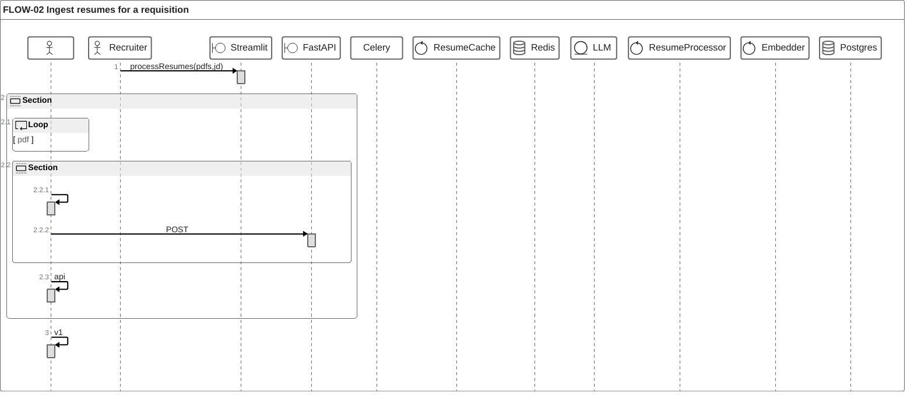

# FLOW-02 Ingest resumes for a requisition

Crosses web → api → worker; lives under `web/` because it starts there.

```mermaid
zenuml
    title FLOW-02 Ingest resumes for a requisition
    @Actor Recruiter
    @Boundary Streamlit
    @Boundary FastAPI
    @Queue Celery
    @Control ResumeCache
    @Database Redis
    @Entity LLM
    @Control ResumeProcessor
    @Control Embedder
    @Database Postgres
    Recruiter->Streamlit.processResumes(pdfs, jd) {
      forEach(pdf) {
        resp = FastAPI.POST /api/v1/extract-resume/async(pdf) {
          if(notPdfExtension) {
            return 400
          }
          FastAPI.save(temp_uploads/filename)
          id = Celery.process_resume_task.delay(path)
          return task_id
        }
        if(queueFailed) {
          Streamlit.showError()
        }
      }
      Celery.process_resume_task(path) {
        resume = ResumeCache.process_resume(path) {
          hit = Redis.get("resume_extract:sha256:model:prompt")
          if(hit) {
            return hit
          }
          r = LLM.extract_resume_data(path)
          Redis.setex(key, 60d, r)
          return r
        }
        if(error) {
          return failed
        }
        Celery.deleteTempFile()
        return success
      }
      while(pendingTasks) {
        state = FastAPI.GET /api/v1/task/id
        Streamlit.sleep(2s)
      }
      forEach(pdf) {
        ResumeProcessor.process_and_link_resume(session, pdf, jd_id) {
          resume = ResumeCache.process_resume(path)
          vectors = Embedder.create_embeddings([text, skills, exp, edu] + skills)
          if(nameExists) {
            Postgres.updateCandidate_and_replace_cand_skill()
          } else {
            Postgres.insertCandidate_and_cand_skill()
          }
          scores = ResumeProcessor.calculate_candidate_scores_for_jd()
          Postgres.upsertApplication(hybrid, parent, skill)
          return (cand_id, name)
        }
        if(error) {
          Streamlit.showError(name)
        }
      }
      return rerun
    }
```
