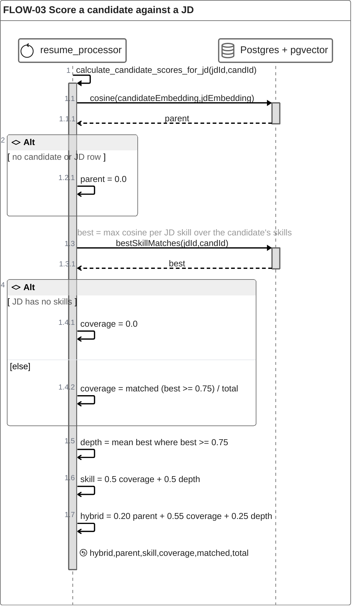

```mermaid
zenuml
title FLOW-03 Score a candidate against a JD
@Control Proc as "resume_processor"
@Database DB as "Postgres + pgvector"

Proc->Proc.calculate_candidate_scores_for_jd(jdId, candId) {
  parent = DB.cosine(candidateEmbedding, jdEmbedding)
  if("no candidate or JD row") {
    Proc->Proc: parent = 0.0
  }
  // best = max cosine per JD skill over the candidate's skills
  best = DB.bestSkillMatches(jdId, candId)
  if("JD has no skills") {
    Proc->Proc: coverage = 0.0
  } else {
    Proc->Proc: coverage = matched (best >= 0.75) / total
  }
  Proc->Proc: depth = mean best where best >= 0.75
  Proc->Proc: skill = 0.5 coverage + 0.5 depth
  Proc->Proc: hybrid = 0.20 parent + 0.55 coverage + 0.25 depth
  return "hybrid, parent, skill, coverage, matched, total"
}
```
