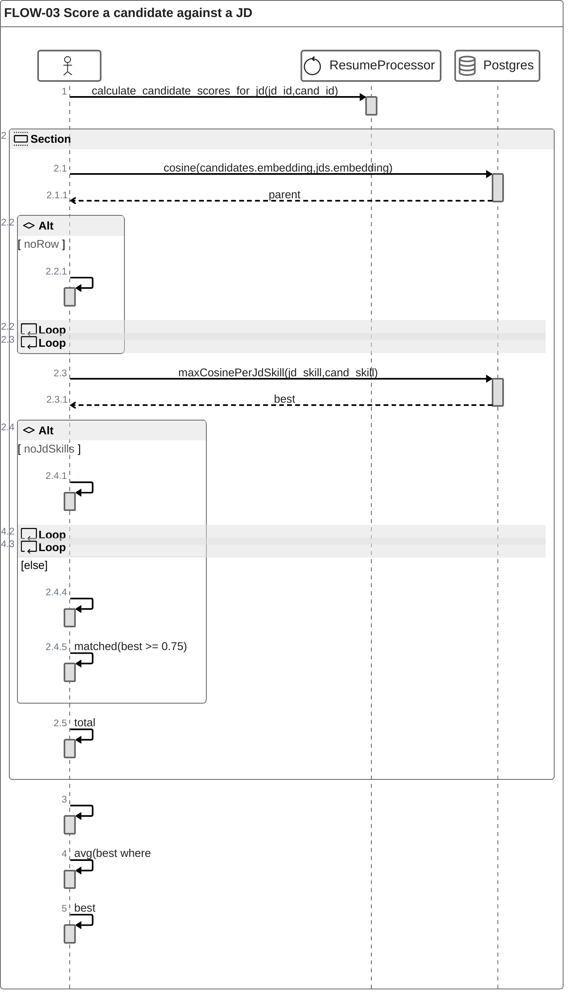

# FLOW-03 Score a candidate against a JD

```mermaid
zenuml
    title FLOW-03 Score a candidate against a JD
    @Control ResumeProcessor
    @Database Postgres
    ResumeProcessor.calculate_candidate_scores_for_jd(jd_id, cand_id) {
      parent = Postgres.cosine(candidates.embedding, jds.embedding)
      if(noRow) {
        parent = 0.0
      }
      best = Postgres.maxCosinePerJdSkill(jd_skill, cand_skill)
      if(noJdSkills) {
        coverage = 0.0
      } else {
        coverage = matched(best >= 0.75) / total
      }
      depth = avg(best where best >= 0.75)
      skill = 0.5 * coverage + 0.5 * depth
      hybrid = 0.20 * parent + 0.55 * coverage + 0.25 * depth
      return {hybrid, parent, skill, coverage, matched, total}
    }
```
