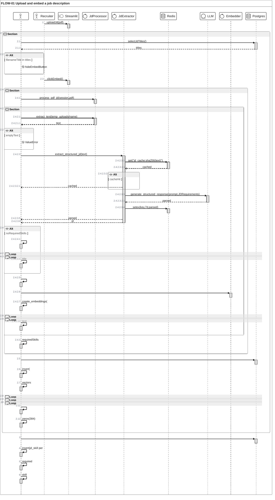

# FLOW-01 Upload and embed a job description

```mermaid
zenuml
    title FLOW-01 Upload and embed a job description
    @Actor Recruiter
    @Boundary Streamlit
    @Control JdProcessor
    @Control JdExtractor
    @Database Redis
    @Entity LLM
    @Control Embedder
    @Database Postgres
    Recruiter->Streamlit.uploadJd(pdf) {
      titles = Postgres.selectJdTitles()
      if(filenameTitle in titles) {
        return hideEmbedButton
      }
      Recruiter->Streamlit.clickEmbed() {
        JdProcessor.process_pdf_jd(session, pdf) {
          text = JdProcessor.extract_text(temp_uploads/name)
          if(emptyText) {
            return ValueError
          }
          jd = JdExtractor.extract_structured_jd(text) {
            cached = Redis.get("jd_cache:sha256(text)")
            if(cacheHit) {
              return cached
            }
            parsed = LLM.generate_structured_response(prompt, JDRequirements)
            Redis.setex(key, 7d, parsed)
            return parsed
          }
          if(noRequiredSkills) {
            requiredSkills = [title]
          }
          vectors = Embedder.create_embeddings([text] + requiredSkills)
          Postgres.insert(jds, embedding=vectors[0], other embeddings=zeros(384))
          Postgres.insert(jd_skill per required skill)
          Postgres.commit()
          if(anyError) {
            Postgres.rollback()
            return error
          }
          return (jd_id, title)
        }
        return successAndRerun
      }
    }
```
