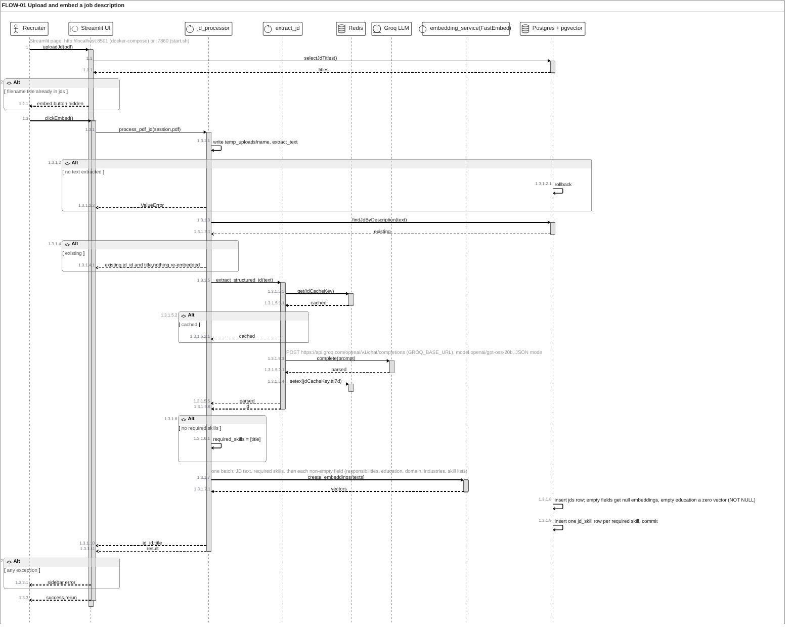

```mermaid
zenuml
title FLOW-01 Upload and embed a job description
@Actor Recruiter
@Boundary UI as "Streamlit UI"
@Control JdProc as "jd_processor"
@Control JdExt as "extract_jd"
@Database Redis
@Entity Groq as "Groq LLM"
@Control Embed as "embedding_service (FastEmbed)"
@Database DB as "Postgres + pgvector"

// Streamlit page: `http://localhost:8501` (docker-compose) or `:7860` (start.sh)
Recruiter->UI.uploadJd(pdf) {
  titles = DB.selectJdTitles()
  if("filename title already in jds") {
    @return UI->Recruiter: embed button hidden
  }
  Recruiter->UI.clickEmbed() {
    result = JdProc.process_pdf_jd(session, pdf) {
      JdProc->JdProc: write temp_uploads/name, extract_text
      if("no text extracted") {
        DB->DB: rollback
        @return JdProc->UI: ValueError
      }
      existing = DB.findJdByDescription(text)
      if(existing) {
        @return JdProc->UI: existing jd_id and title, nothing re-embedded
      }
      jd = JdExt.extract_structured_jd(text) {
        cached = Redis.get(jdCacheKey)
        if(cached) {
          return cached
        }
        // `POST https://api.groq.com/openai/v1/chat/completions` (GROQ_BASE_URL), model openai/gpt-oss-20b, JSON mode
        parsed = Groq.complete(prompt)
        Redis.setex(jdCacheKey, ttl7d)
        return parsed
      }
      if("no required skills") {
        JdProc->JdProc: required_skills = [title]
      }
      // one batch: JD text, required skills, then each non-empty field (responsibilities, education, domain, industries, skill lists)
      vectors = Embed.create_embeddings(texts)
      DB->DB: insert jds row; empty fields get null embeddings, empty education a zero vector (NOT NULL)
      DB->DB: insert one jd_skill row per required skill, commit
      return "jd_id, title"
    }
    if("any exception") {
      @return UI->Recruiter: sidebar error
    }
    return "success, rerun"
  }
}
```
