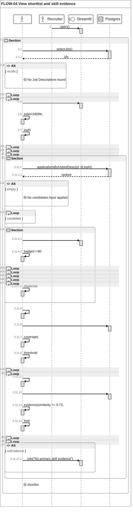

# FLOW-04 View shortlist and skill evidence

```mermaid
zenuml
    title FLOW-04 View shortlist and skill evidence
    @Actor Recruiter
    @Boundary Streamlit
    @Database Postgres
    Recruiter->Streamlit.open() {
      jds = Postgres.selectJds()
      if(noJds) {
        return "No Job Descriptions found"
      }
      Recruiter->Streamlit.selectJd(title, topN 1..10) {
        ranked = Postgres.applicationsByHybridDesc(jd_id, topN)
        if(empty) {
          return "No candidates have applied"
        }
        forEach(candidate) {
          Streamlit.badge(>=80 Top, >=65 Strong, else Moderate)
          cov = Postgres.coverage(threshold 0.75)
          ev = Postgres.evidence(similarity >= 0.72, limit 10)
          if(noEvidence) {
            Streamlit.info("No primary skill evidence")
          }
        }
        return shortlist
      }
    }
```
