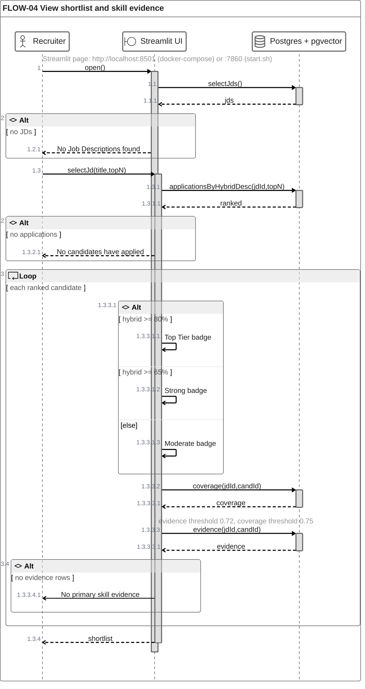

```mermaid
zenuml
title FLOW-04 View shortlist and skill evidence
@Actor Recruiter
@Boundary UI as "Streamlit UI"
@Database DB as "Postgres + pgvector"

// Streamlit page: `http://localhost:8501` (docker-compose) or `:7860` (start.sh)
Recruiter->UI.open() {
  jds = DB.selectJds()
  if("no JDs") {
    @return UI->Recruiter: No Job Descriptions found
  }
  Recruiter->UI.selectJd(title, topN) {
    ranked = DB.applicationsByHybridDesc(jdId, topN)
    if("no applications") {
      @return UI->Recruiter: No candidates have applied
    }
    loop("each ranked candidate") {
      if("hybrid >= 80%") {
        UI->UI: Top Tier badge
      } else if("hybrid >= 65%") {
        UI->UI: Strong badge
      } else {
        UI->UI: Moderate badge
      }
      coverage = DB.coverage(jdId, candId)
      // evidence threshold 0.72, coverage threshold 0.75
      evidence = DB.evidence(jdId, candId)
      if("no evidence rows") {
        UI->Recruiter: No primary skill evidence
      }
    }
    return shortlist
  }
}
```
